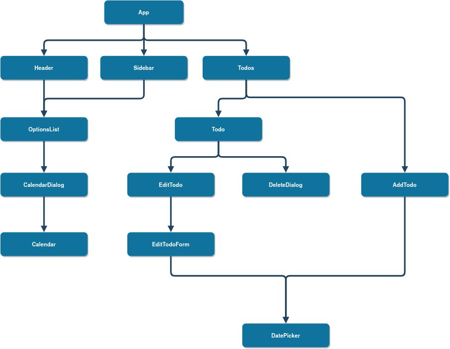

# TODOList
Uma aplicação usando React + MaterialUI + React Scheduler.

## Fluxo da Aplicação

Esta aplicação foi desenvolvida tendo em mente a ideia de componentes e containers. No final da seção tem uma imagem ilustrando o fluxo da aplicação.

A aplicação é dividida nesses containers e componentes:
#### Containers:
* **App** - Container raiz da aplicação.
Este container possui um estado com as tarefas da aplicação, um estado que contém o filtro que será utilizado e um estado com o termo de busca digitado pelo usuário. 
Ele é responsável por exibir o container **Todos** enviando como *props* uma lista de tarefas já filtradas.

* **Header** - Contém o menu superior da aplicação e é responsável por controlar o menu lateral em dispositivos móveis.
Também é responsável por guardar o termo digitado na barra de pesquisa e enviá-lo para **App**.

* **OptionsList** - Container que possui a lista de opções da aplicação. Todos os itens nessa lista exceto o último são filtros que são passados para **App** através da função *filterTodos* passada nas *props*. O último item é um botão para mostrar o calendário utilizando **CalendarDialog**. Este container é chamado em **Sidebar** para desktop e em **Header** para dispositivos móveis.

* **Todos** - Container responsável por lidar com as operações *CRUD* da tarefa. Nele são definidos as funções para adicionar, apagar ou atualizar uma tarefa (*handleAddTodoInput*, *deleteTodo* e *handleEditTodoSubmit* respectivamente). 
Além disso, o container retorna uma lista com todas tarefas passadas pelas *props*.

* **AddTodo** - Exibe um botão de input e um botão para selecionar uma data. Recebe *handleAddTodoInput* como *props* e o executa quando a tecla *__Enter__* é pressionada.

* **EditTodoForm** - Exibe um formulário para editar as informações de uma tarefa.
Recebe *handleEditTodoSubmit* e as informações de texto, data e anotações da tarefa como *props* e atualiza a tarefa com os dados no formulário após clicar no botão de salvar.

* **Todo** - Responsável por exibir uma tarefa específica. Recebe nas *props* as informações de uma tarefa específica as funções *deleteTodo* e *handleCheckbox*, sendo essa última responsável por marcar uma tarefa como concluída. Além disso, é responsável por chamar a tela de edição de uma tarefa (**EditTodo**) e o modal de confirmação de exclusão da tarefa (**DeleteDialog**).

#### Componentes:
* **Calendar** - Recebe como *props* uma lista de tarefas e as exibe em um calendário.

* **CalendarDialog** - Exibe **Calendar** dentro de um modal.

* **DatePicker** - Exibe um botão com ícone que quando clicado mostra um mini calendário para o usuário escolher uma data e a guarda. Se uma data for passada para esse componente através de *props* ele exibe um botão para apagar a data guardada.

* **DeleteDialog** - mostra um modal de confirmação de exclusão de uma tarefa. Recebe o id da tarefa e *deleteTodo* através de *props* e exclui a tarefa caso o usuário aperte o botão de confirmação.

* **EditTodo** - Um componente que estiliza e adiciona as margens para o **EditTodoForm**.

* **Sidebar** - Barra lateral que mostra as opções de filtros e mostrar calendário no desktop. Recebe como *props* o **OptionsList** e o renderiza.

#### Imagem do fluxo do app:

